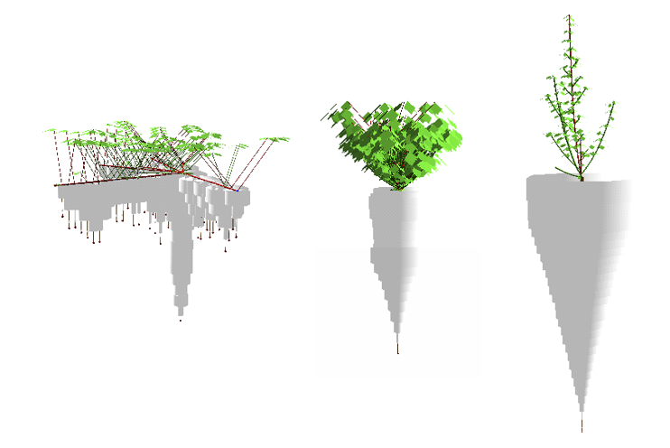

# L-egume

This is L-egume model, a generic model of forage legume morphogenesis.

See :
* Louarn, G., Faverjon, L. (2018). A generic individual-based model to simulate morphogenesis, C–N acquisition and population dynamics in contrasting forage legumes. Annals of botany, 121(5), 875-896.
* Faverjon, L. (2018). Calibration et evaluation d’un modele individu-centre generique de morphogenese des legumineuses fourrageres – Application a la prediction des equilibres inter-specifiques dans des communautes prairiales  experimentales. PhD Thesis. Univ. Poitiers.



### Installation

First, **Conda** needs to be installed, see instruction on [openaleala documentation](https://openalea.readthedocs.io/en/latest/install.html).

#### for user
Creating a new conda environment with legume and its dependencies installed
```bash
mamba create -n legume -c openalea3 -c openalea3 -c conda-forge openalea.legume
```

#### for developer
```bash
mamba env create -f ./conda/environment.yml
```
This will create a conda environment with dependencies installed and install legume in editable state.


[//]: # (### 1.3 Running)

[//]: # ()
[//]: # (* open and activate the *legume* conda environment with installed models)

[//]: # ()
[//]: # (To run a simulation example, three options:)

[//]: # ()
[//]: # (* 1. Run l-egume from the L-py GUI,)

[//]: # (	 launch 'lpy' from the *legume* conda environment )

[//]: # (	 open/load 'l-egume.lpy' file from l-egume folder,)

[//]: # (	 Use Run or Animate button to launch a simulation from within L-py GUI)

[//]: # (	 )
[//]: # (  2. Run l-egume from the command line: )

[//]: # (		- default example:)

[//]: # (		```bash)

[//]: # (		python run_legume_usm.py)

[//]: # (		```)

[//]: # (		- run of a specific Unit of Simulation &#40;USM&#41;:)

[//]: # (		```bash)

[//]: # (		python run_legume_usm.py -f 'usm_xlsfile' -i 'inputs_folder' -b 'usm_spreasheet_name' -u 'usmID' -o 'outputs_folder')

[//]: # (		```)

[//]: # (		)
[//]: # (  )
[//]: # (  3. Run multiple simulations: see l-egume_batch.py in multisim folder for an example &#40;require mutiprocessing&#41;)

[//]: # ()
[//]: # (See the user guide for a step by step explanation of how to set and run model *L-egume* &#40;https://github.com/glouarn/TD_VGL&#41;.)

## Contact

For further assistance, you can reach out to the development team creating an [issue on github](https://github.com/openalea-incubator/l-egume/issues)

## Versioning

We use a Git repository of OpenAlea on [GitHub](https://github.com/openalea-incubator/) for 
versioning: https://github.com/openalea-incubator/l-egume  
If you need an access to the current development version of the model, please send 
an email to <gaetan.louarn @ inrae.fr>.
For versionning, use a git client and get git clone git+git@github.com:openalea-incubator/l-egume.git SSH will is required

## Authors

**Gaetan LOUARN**, **Lucas FAVERJON** - see file [AUTHORS](AUTHORS) for details

## License

This project is licensed under the CeCILL-C License - see file [LICENSE](LICENSE) for details
